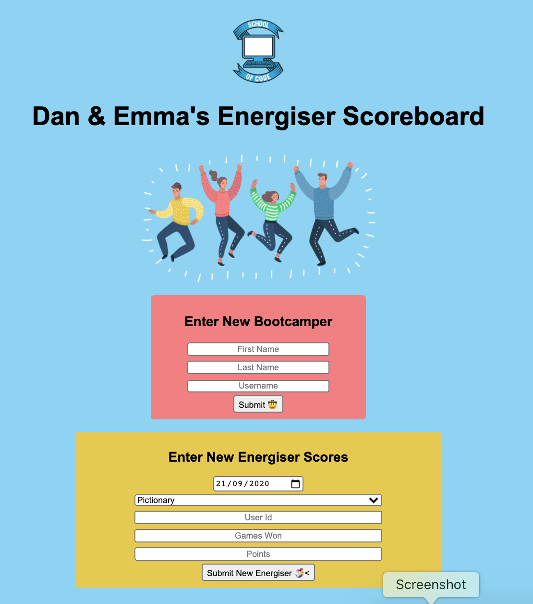

# Recipe Api Intro to PostgreSQL

_16th October 2020_
_Week 4 at the [School of Code](https://www.schoolofcode.co.uk)_

This was our week 4 Friday hackathon at the [School of Code](https://www.schoolofcode.co.uk) which was our first full-stack application using node.js, express, postgreSQL and JavaScript

Dan Watson @danwatson2309 (my paired-programming partner for the week) and I created a front-end to display our energiser game scores and a back-end with persistent storage

This was a really fun hackethon and we were super proud of it

👾 **Energiser Game Scoreboard** 🕹️




## Built with

- HTML
- CSS
- JavaScript
- PostgreSQL
- Node.js
- Express

## Installation

1. Clone the repository

```
https://github.com/randleem/energiser-scoreboard-with-backend.git
```

2. Navigate to the repo

3. Install the required node modules

```
npm i
```

4. Create a .env file to enter your Heroku Database credentials

```
touch .env
```

5. Add your Heroku Database credentials to the .env file

```
PGHOST= "your host details"

PGDATABASE= "your database details"

PGUSER= "your user details"

PGPORT= "your post number"

PGPASSWORD= "your password"
```

6. Start the application

```
npm run start
```
